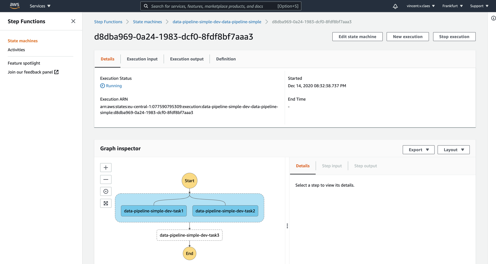

# Datajob

#### Build and deploy a serverless data pipeline with no effort on AWS.

- Deploy your code to a glue job.
- Package your project and make it available for your glue jobs.
- Orchestrate your pipeline using stepfunctions as simple as `task1 >> [task2,task3] >> task4`

> The main dependencies are [AWS CDK](https://github.com/aws/aws-cdk) and [Step Functions SDK for data science](https://github.com/aws/aws-step-functions-data-science-sdk-python)  
> Ideas to be implemented can be found [below](#ideas)  
> [Feedback](https://github.com/vincentclaes/datajob/discussions) is much appreciated!

# Installation

 Datajob can be installed using pip.  
 Beware that we depend on [aws cdk cli](https://github.com/aws/aws-cdk)!

    pip install datajob
    npm install -g aws-cdk@1.87.1 # latest version of datajob depends this version

# Quickstart

## Configure the pipeline
**We have 3 scripts that we want to orchestrate sequentially and in parallel on AWS using Glue and Step Functions**.

    from datajob.datajob_stack import DataJobStack
    from datajob.glue.glue_job import GlueJob
    from datajob.stepfunctions.stepfunctions_workflow import StepfunctionsWorkflow

    # the datajob_stack is the instance that will result in a cloudformation stack.
    # we inject the datajob_stack object through all the resources that we want to add.
    with DataJobStack(stack_name="data-pipeline-simple") as datajob_stack:

        # here we define 3 glue jobs with the datajob_stack object,
        # a name and the relative path to the source code.
        task1 = GlueJob(
            datajob_stack=datajob_stack,
            name="task1",
            job_path="data_pipeline_simple/task1.py",
        )
        task2 = GlueJob(
            datajob_stack=datajob_stack,
            name="task2",
            job_path="data_pipeline_simple/task2.py",
        )
        task3 = GlueJob(
            datajob_stack=datajob_stack,
            name="task3",
            job_path="data_pipeline_simple/task3.py",
        )

        # we instantiate a step functions workflow and add the sources
        # we want to orchestrate. We got the orchestration idea from
        # airflow where we use a list to run tasks in parallel
        # and we use bit operator '>>' to chain the tasks in our workflow.
        with StepfunctionsWorkflow(
            datajob_stack=datajob_stack, name="data-pipeline-simple"
        ) as sfn:
            [task1, task2] >> task3

The definition of our pipeline can be found in `examples/data_pipeline_simple/datajob_stack.py`.

## Deploy

Set the aws account number and the profile that contains your aws credentials (`~/.aws/credentials`) as environment variables:

    export AWS_PROFILE=my-profile
    export AWS_DEFAULT_REGION=your-region # e.g. eu-west-1

Point to the configuration of the pipeline using `--config` and deploy

    cd examples/data_pipeline_simple
    datajob deploy --config datajob_stack.py

# Run
After running the `deploy` command, the code of the 3 tasks are deployed to a glue job and the glue jobs are orchestrated using step functions.
Go to the AWS console to the step functions service, look for `data-pipeline-simple` and click on "Start execution"

Follow up on the progress.

# Destroy

Once the pipeline is finished you can pull down the pipeline by using the command:

    datajob destroy --config datajob_stack.py

As simple as that!

> Note: When using datajob cli to deploy a pipeline, we shell out to aws cdk.
> You can circumvent shelling out to aws cdk by running `cdk` explicitly.
> datajob cli prints out the commands it uses in the back to build the pipeline.
> If you want, you can use those.

# Ideas

Any suggestions can be shared by starting a [discussion](https://github.com/vincentclaes/datajob/discussions)

These are the ideas, we find interesting to implement;

- trigger a pipeline using the cli; `datajob run --pipeline my-simple-pipeline`
- implement a data bucket, that's used for your pipeline.
- add a time based trigger to the step functions workflow.
- add an s3 event trigger to the step functions workflow.
- add a lambda that copies data from one s3 location to another.
- version your data pipeline.
- implement sagemaker services
    - processing jobs
    - hyperparameter tuning jobs
    - training jobs
    - create sagemaker model
    - create sagemaker endpoint
    - expose sagemaker endpoint to the internet by levering lambda + api gateway

- create a serverless UI that follows up on the different pipelines deployed on possibly different AWS accounts using Datajob
