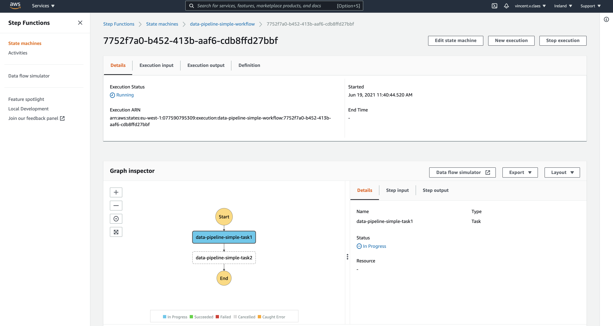

<div align="center">
 <b>Build and deploy a serverless data pipeline on AWS with no effort.</b></br>
 <i>Our goal is to let developers think about the business logic, datajob does the rest...</i>
 </br>
 </br>
 </br>
</div>


- We support creating and deploying code to python shell / pyspark Glue jobs.
- Orchestrate the glue jobs using stepfunctions as simple as `task1 >> task2 >> task3`
- Let us [know](https://github.com/vincentclaes/datajob/discussions) what you want to see next.

> Dependencies are [AWS CDK](https://github.com/aws/aws-cdk) and [Step Functions SDK for data science](https://github.com/aws/aws-step-functions-data-science-sdk-python) <br/>

# Installation

 Datajob can be installed using pip. <br/>
 Beware that we depend on [aws cdk cli](https://github.com/aws/aws-cdk)!

    pip install datajob
    npm install -g aws-cdk@1.109.0 # latest version of datajob depends this version

# Quickstart

You can find the full example in [examples/data_pipeline_simple](./examples/data_pipeline_simple/).

We have a simple data pipeline composed of [2 glue jobs](./examples/data_pipeline_simple/glue_jobs/) orchestrated sequentially using step functions.

```python
from aws_cdk import core

from datajob.datajob_stack import DataJobStack
from datajob.glue.glue_job import GlueJob
from datajob.stepfunctions.stepfunctions_workflow import StepfunctionsWorkflow

app = core.App()

# The datajob_stack is the instance that will result in a cloudformation stack.
# We inject the datajob_stack object through all the resources that we want to add.
with DataJobStack(scope=app, id="data-pipeline-simple") as datajob_stack:

    # We define 2 glue jobs with the relative path to the source code.
    task1 = GlueJob(
        datajob_stack=datajob_stack, name="task1", job_path="glue_jobs/task.py"
    )
    task2 = GlueJob(
        datajob_stack=datajob_stack, name="task2", job_path="glue_jobs/task2.py"
    )

    # We instantiate a step functions workflow and orchestrate the glue jobs.
    with StepfunctionsWorkflow(datajob_stack=datajob_stack, name="workflow") as sfn:
        task1 >> task2

app.synth()

```

We add the above code in a file called `datajob_stack.py` in the [root of the project](./examples/data_pipeline_with_packaged_project/).


### Configure CDK
Follow the steps [here](https://docs.aws.amazon.com/cli/latest/userguide/cli-configure-quickstart.html#cli-configure-quickstart-config) to configure your credentials.

```shell script
export AWS_PROFILE=default
# use the aws cli to get your account number
export AWS_ACCOUNT=$(aws sts get-caller-identity --query Account --output text --profile $AWS_PROFILE)
export AWS_DEFAULT_REGION=us-east-2

# init cdk
cdk bootstrap aws://$AWS_ACCOUNT/$AWS_DEFAULT_REGION
```

### Deploy

Deploy the pipeline using CDK.

```shell
cd examples/data_pipeline_simple
cdk deploy --app  "python datajob_stack.py"
```

### Run

```shell script
datajob execute --state-machine data-pipeline-simple-workflow
```
The terminal will show a link to the step functions page to follow up on your pipeline run.



### Destroy

```shell script
cdk destroy --app  "python datajob_stack.py"
```

# Functionality

<details>
<summary>Deploy to a stage</summary>

Specify a stage to deploy an isolated pipeline.

Typical examples would be `dev` , `prod`, ...

```shell
cdk deploy --app "python datajob_stack.py" --stage my-stage
```

</details>

<details>

<summary>Using datajob's S3 data bucket</summary>

Dynamically reference the `datajob_stack` data bucket name to the arguments of your GlueJob by calling
`datajob_stack.context.data_bucket_name`.

```python
import pathlib

from aws_cdk import core
from datajob.datajob_stack import DataJobStack
from datajob.glue.glue_job import GlueJob
from datajob.stepfunctions.stepfunctions_workflow import StepfunctionsWorkflow

current_dir = str(pathlib.Path(__file__).parent.absolute())

app = core.App()

with DataJobStack(
    scope=app, id="datajob-python-pyspark", project_root=current_dir
) as datajob_stack:

    pyspark_job = GlueJob(
        datajob_stack=datajob_stack,
        name="pyspark-job",
        job_path="glue_job/glue_pyspark_example.py",
        job_type="glueetl",
        glue_version="2.0",  # we only support glue 2.0
        python_version="3",
        worker_type="Standard",  # options are Standard / G.1X / G.2X
        number_of_workers=1,
        arguments={
            "--source": f"s3://{datajob_stack.context.data_bucket_name}/raw/iris_dataset.csv",
            "--destination": f"s3://{datajob_stack.context.data_bucket_name}/target/pyspark_job/iris_dataset.parquet",
        },
    )

    with StepfunctionsWorkflow(datajob_stack=datajob_stack, name="workflow") as sfn:
        pyspark_job >> ...

```

you can find this example [here](./examples/data_pipeline_pyspark/glue_job/glue_pyspark_example.py)

</details>

<details>
<summary>Deploy files to deployment bucket</summary>

Specify the path to the folder we would like to include in the deployment bucket.

```python

from aws_cdk import core
from datajob.datajob_stack import DataJobStack

app = core.App()

with DataJobStack(
    scope=app, id="some-stack-name", include_folder="path/to/folder/"
) as datajob_stack:

    ...

```

</details>

<details>
<summary>Package project</summary>

Package you project using [poetry](https://python-poetry.org/)

```shell
datajob deploy --config datajob_stack.py --package poetry
```
Package you project using [setup.py](./examples/data_pipeline_with_packaged_project)
```shell
datajob deploy --config datajob_stack.py --package setuppy
```
</details>

<details>
<summary>Using Pyspark</summary>

```python
import pathlib

from aws_cdk import core
from datajob.datajob_stack import DataJobStack
from datajob.glue.glue_job import GlueJob
from datajob.stepfunctions.stepfunctions_workflow import StepfunctionsWorkflow

current_dir = str(pathlib.Path(__file__).parent.absolute())

app = core.App()

with DataJobStack(
    scope=app, id="datajob-python-pyspark", project_root=current_dir
) as datajob_stack:

    pyspark_job = GlueJob(
        datajob_stack=datajob_stack,
        name="pyspark-job",
        job_path="glue_job/glue_pyspark_example.py",
        job_type="glueetl",
        glue_version="2.0",  # we only support glue 2.0
        python_version="3",
        worker_type="Standard",  # options are Standard / G.1X / G.2X
        number_of_workers=1,
        arguments={
            "--source": f"s3://{datajob_stack.context.data_bucket_name}/raw/iris_dataset.csv",
            "--destination": f"s3://{datajob_stack.context.data_bucket_name}/target/pyspark_job/iris_dataset.parquet",
        },
    )
```
full example can be found in [examples/data_pipeline_pyspark](examples/data_pipeline_pyspark]).
</details>

<details>
<summary>Orchestrate stepfunctions tasks in parallel</summary>

```python
# Task2 comes after task1. task4 comes after task3.
# Task 5 depends on both task2 and task4 to be finished.
# Therefore task1 and task2 can run in parallel,
# as well as task3 and task4.
with StepfunctionsWorkflow(datajob_stack=datajob_stack, name="workflow") as sfn:
    task1 >> task2
    task3 >> task4
    task2 >> task5
    task4 >> task5

```
More can be found in [examples/data_pipeline_parallel](./examples/data_pipeline_parallel)

</details>

<details>
<summary>Orchestrate 1 stepfunction task</summary>

Use the [Ellipsis](https://docs.python.org/dev/library/constants.html#Ellipsis) object to be able to orchestrate 1 job via step functions.

```python
some_task >> ...
```

</details>

<details>
<summary>Notify in case of error/success.</summary>

Provide the parameter `notification` in the constructor of a `StepfunctionsWorkflow` object.
This will create an SNS Topic which will be triggered in case of failure or success.
The email will subscribe to the topic and receive the notification in its inbox.

```python
with StepfunctionsWorkflow(datajob_stack=datajob_stack,
                           name="workflow",
                           notification="email@domain.com") as sfn:
    task1 >> task2
```

You can provide 1 email or a list of emails `["email1@domain.com", "email2@domain.com"]`.

</details>

# Datajob in depth

The `datajob_stack` is the instance that will result in a cloudformation stack.
The path in `project_root` helps `datajob_stack` locate the root of the project where
the setup.py/poetry pyproject.toml file can be found, as well as the `dist/` folder with the wheel of your project .

```python
import pathlib
from aws_cdk import core

from datajob.datajob_stack import DataJobStack

current_dir = pathlib.Path(__file__).parent.absolute()
app = core.App()

with DataJobStack(
    scope=app, id="data-pipeline-pkg", project_root=current_dir
) as datajob_stack:

    ...
```

When __entering the contextmanager__ of DataJobStack:

A [DataJobContext](./datajob/datajob_stack.py#L48) is initialized
to deploy and run a data pipeline on AWS.
The following resources are created:
1) "data bucket"
    - an S3 bucket that you can use to dump ingested data, dump intermediate results and the final output.
    - you can access the data bucket as a [Bucket](https://docs.aws.amazon.com/cdk/api/latest/python/aws_cdk.aws_s3/Bucket.html) object via ```datajob_stack.context.data_bucket```
    - you can access the data bucket name via ```datajob_stack.context.data_bucket_name```
2) "deployment bucket"
   - an s3 bucket to deploy code, artifacts, scripts, config, files, ...
   - you can access the deployment bucket as a [Bucket](https://docs.aws.amazon.com/cdk/api/latest/python/aws_cdk.aws_s3/Bucket.html) object via ```datajob_stack.context.deployment_bucket```
   - you can access the deployment bucket name via ```datajob_stack.context.deployment_bucket_name```

when __exiting the context manager__ all the resources of our DataJobStack object are created.

<details>
<summary>We can write the above example more explicitly...</summary>

```python
import pathlib
from aws_cdk import core

from datajob.datajob_stack import DataJobStack
from datajob.glue.glue_job import GlueJob
from datajob.stepfunctions.stepfunctions_workflow import StepfunctionsWorkflow

app = core.App()

current_dir = pathlib.Path(__file__).parent.absolute()

app = core.App()

datajob_stack = DataJobStack(scope=app, id="data-pipeline-pkg", project_root=current_dir)
datajob_stack.init_datajob_context()

task1 = GlueJob(datajob_stack=datajob_stack, name="task1", job_path="glue_jobs/task.py")
task2 = GlueJob(datajob_stack=datajob_stack, name="task2", job_path="glue_jobs/task2.py")

with StepfunctionsWorkflow(datajob_stack=datajob_stack, name="workflow") as step_functions_workflow:
    task1 >> task2

datajob_stack.create_resources()
app.synth()
```
</details>

# Ideas

Any suggestions can be shared by starting a [discussion](https://github.com/vincentclaes/datajob/discussions)

These are the ideas, we find interesting to implement;

- add a time based trigger to the step functions workflow.
- add an s3 event trigger to the step functions workflow.
- add a lambda that copies data from one s3 location to another.
- version your data pipeline.
- cli command to view the logs / glue jobs / s3 bucket
- implement sagemaker services
    - processing jobs
    - hyperparameter tuning jobs
    - training jobs
- implement lambda
- implement ECS Fargate
- create a serverless UI that follows up on the different pipelines deployed on possibly different AWS accounts using Datajob

> [Feedback](https://github.com/vincentclaes/datajob/discussions) is much appreciated!
