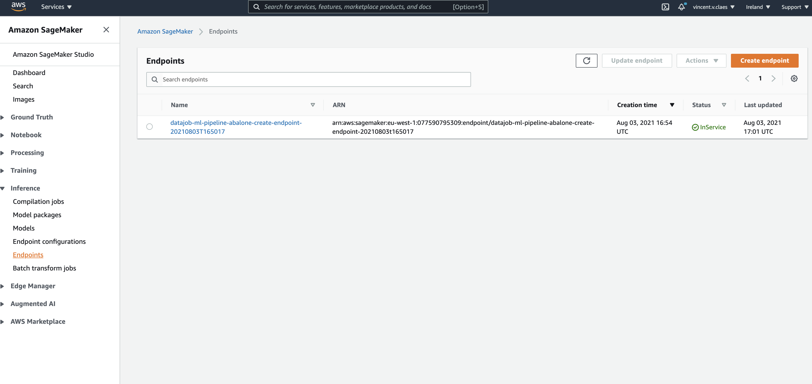

# ML Pipeline Scikitlearn

We want to predict the age of abalone (sea snails) from their physical measurements using XG Boost algorithm.

We will setup an ML pipeline that prepares the abalone datatset, launches a training step and deploys the model behind a sagemaker endpoint.

we have 5 steps in our ML pipeline

- prepare_dataset_step: this task is a glue job that splits a dataset into train, validation, and test datasets. It then uploads the datasets to the sagemaker default bucket.
- training_step: train a ml model using XG Boost.
- model_step: get the model from the training step and create a sagemaker model.
- endpoint_config_step: create a configuration for deploying the sagemaker model behind an endpoint.
- endpoint_step: create a sagemaker endpoint using the endpoint_config_step

## Deploy

    cd examples/ml_pipeline_abalone
    export AWS_PROFILE=my-profile
    export AWS_DEFAULT_REGION=eu-west-1
    cdk deploy --app "python datajob_stack.py" --require-approval never

             ✅  datajob-ml-pipeline-abalone

            Outputs:
            datajob-ml-pipeline-abalone.DatajobExecutionInput = ["datajob-ml-pipeline-abalone-train-model", "datajob-ml-pipeline-abalone-create-sagemaker-model", "datajob-ml-pipeline-abalone-create-sagemaker-endpoint-config", "datajob-ml-pipeline-abalone-create-endpoint"]

            Stack ARN:
            arn:aws:cloudformation:eu-west-1:077590795309:stack/datajob-ml-pipeline-abalone/e179ec30-f45a-11eb-9731-02575f1b7adf

execute the ml pipeline

    datajob execute --state-machine datajob-ml-pipeline-abalone-workflow

            [18:50:18] execution input found:
                       {'datajob-ml-pipeline-abalone-train-model': 'datajob-ml-pipeline-abalone-train-model-20210803T165017',
                       'datajob-ml-pipeline-abalone-create-sagemaker-model': 'datajob-ml-pipeline-abalone-create-sagemaker-mo-20210803T165017',
                       'datajob-ml-pipeline-abalone-create-sagemaker-endpoint-config': 'datajob-ml-pipeline-abalone-create-sagemaker-en-20210803T165017',
                       'datajob-ml-pipeline-abalone-create-endpoint': 'datajob-ml-pipeline-abalone-create-endpoint-20210803T165017'}
                       executing: datajob-ml-pipeline-abalone-workflow
            [18:50:19] status: RUNNING
                       view the execution on the AWS console:

            https://console.aws.amazon.com/states/home?region=eu-west-1#/executions/details/arn:aws:states:eu-west-1:077590795309:execution:datajob-ml-pipeline-abalone-workflow:631ca72f-33f2-4a4e-8685-432c43fcbf05

If you click the link, you can follow up on the progress

In the end a sagemaker endpoint is created:

In our example the name of the endpoint is `datajob-ml-pipeline-abalone-create-endpoint-20210803T165017`
Pull down the sagemaker endpoint by executing the following command:

    aws sagemaker delete-endpoint --endpoint-name datajob-ml-pipeline-abalone-create-endpoint-20210803T165017
