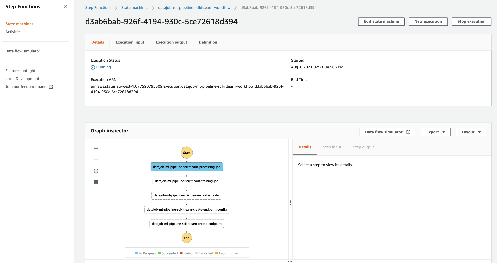

# ML Pipeline Scikitlearn

An ML pipeline that has a preprocessing step and a training step.

## Deploy

    cd examples/ml_pipeline_sagemaker_scikitlearn
    export AWS_PROFILE=my-profile
    export AWS_DEFAULT_REGION=eu-west-1
    cdk deploy --app "python datajob_stack.py" --require-approval never

execute the ml pipeline

    datajob execute --state-machine datajob-ml-pipeline-scikitlearn-workflow

            [16:57:28] execution input found:
                   {'datajob-ml-pipeline-scikitlearn-processing-job': 'datajob-ml-pipeline-scikitlearn-processing-job-20210801T145727',
                   'datajob-ml-pipeline-scikitlearn-training-job': 'datajob-ml-pipeline-scikitlearn-training-job-20210801T145727',
                   'datajob-ml-pipeline-scikitlearn-create-model': 'datajob-ml-pipeline-scikitlearn-create-model-20210801T145727',
                   'datajob-ml-pipeline-scikitlearn-create-endpoint-config': 'datajob-ml-pipeline-scikitlearn-create-endpoint-20210801T145727',
                   'datajob-ml-pipeline-scikitlearn-create-endpoint': 'datajob-ml-pipeline-scikitlearn-create-endpoint-20210801T145727'}
                   executing: datajob-ml-pipeline-scikitlearn-workflow
            [16:57:29] status: RUNNING
                       view the execution on the AWS console:

            https://console.aws.amazon.com/states/home?region=eu-west-1#/executions/details/arn:aws:states:eu-west-1:1234567890:execution:datajob-ml-pipeline-scikitlearn-workflow:fa820474-0fd4-4650-8a96-47d14edcf298

If you click the link, you can follow up on the progress

In the end a sagemaker endpoint is created that we can call.

To remove the sagemaker endpoint execute:

    aws sagemaker  delete-endpoint --endpoint-name datajob-ml-pipeline-scikitlearn-create-endpoint-20210801T145727
